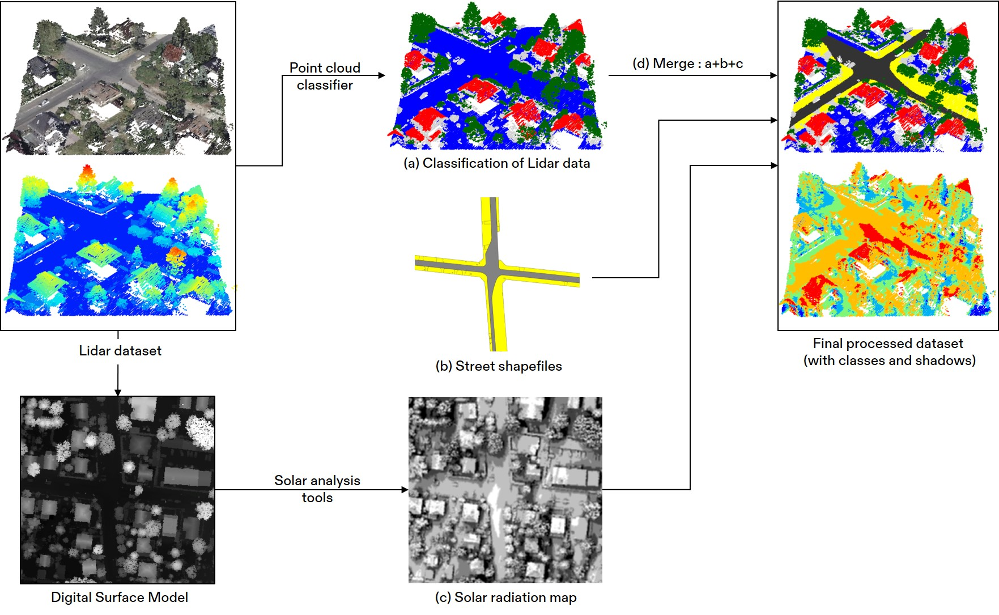
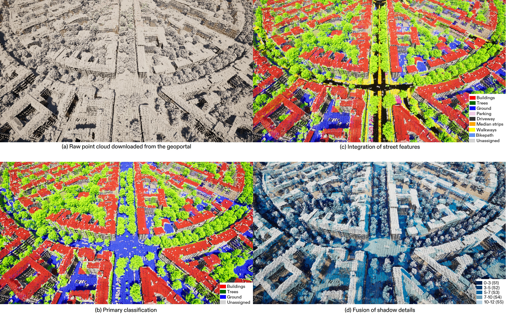
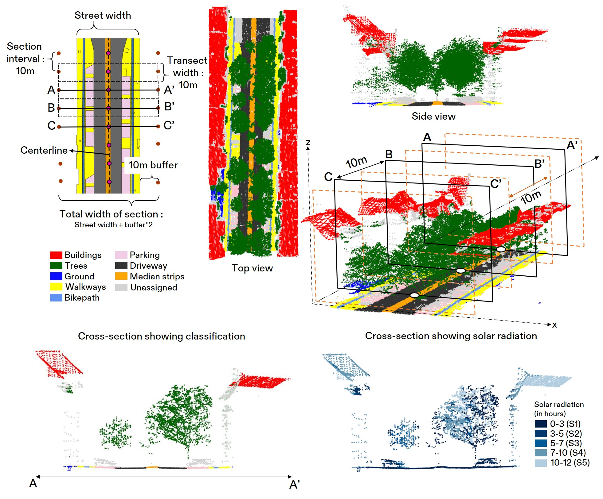

# CITYLID: A large-scale categorized aerial Lidar dataset for street-level research

## Overview
This repository provides a categorized aerial Lidar dataset, CITYLID, along with the methodology for data preparation. 
The repository has two main parts. First, It explains the process for raw point cloud categorization. The process includes the fusion of other datasets, such as 2D street shapefiles and shadow maps. It provides supporting codes and scripts to replicate the steps leading to the final data product. Secondly, It provides example scripts to reproduce a study focused on [generating city-wide street cross-sections](https://doi.org/10.1016/j.scs.2023.104673), which 
used the CITYLID dataset.

## Getting Started

### Dataset Overview

The raw point-cloud dataset and detailed street map used in this project were obtained from the Geodata Portal of Berlin state, accessible via [FISBroker](https://fbinter.stadt-berlin.de/fb/index.jsp). The Lidar dataset is provided in [*.las 1.4 format](https://fbinter.stadt-berlin.de/fb/feed/senstadt/a_als/0 ), a lossless point cloud storage format, with a density of 9.8 points per square meter, and last updated on 02.03.2021. Additionally, the Berlin geoportal offers Straßenbefahrung 2014, a comprehensive city street plan provided as shapefiles. This street plan was created through meticulous digitization based on an extensive street survey conducted between 2014 and 2015, with the final publication in 2019. It includes detailed subdivisions of streets into driveways, bike paths, median strips, walkways, parking areas, and other street infrastructure.

### Prerequisites

The research utilizes a range of scripts and algorithms, including [LAStools](https://github.com/LAStools/LAStools), [lidR](https://github.com/r-lidar/lidR), [PDAL](https://github.com/PDAL/PDAL), [GDAL](https://github.com/OSGeo/gdal), QGIS, and ArcGIS Pro, to process Lidar and GIS-based polygon data and for application which involves extracting cross-sectional details. An open-source application [CloudCompare](https://www.danielgm.net/cc/) can be used for point cloud visualization.

## Methodology

  
   
  <em>Overall methodology for dataset creation</em>

### Primary Classification
The LASTools software suite was employed for point cloud classification. LASTools consists of a set of efficient multicore command line tools designed for processing Lidar datasets. Within this suite, tools such as *lasground*, *lasheight*, and *lasclassify* were utilized to classify the dataset. The raw dataset is divided into 1,060 tiles, and each of them is classified into categories such as *ground*, *trees*, *buildings*, and *unassigned* points. Notably, water bodies were not identified during the process, as the classifier does not differentiate between open ground and water due to their similar point properties. Consequently, water bodies were categorized as part of the *ground* class.

### Integration of Street Features to the Primary Classification
Due to the distinct data structures of street polygons (2D) and Lidar-based (3D) points, direct integration is not feasible. To address this, we employed the Point Data Abstraction Library (PDAL). PDAL offers a range of filters designed for processing Lidar point clouds. We converted vector-based shapefiles into RGB raster images and utilized *colorize* and *range* filters. These filters merge the raster dataset with the point cloud, enabling the points to adopt the RGB values of the overlapped raster. Starter scripts for automating this integration process are provided in [Data_integration](Data_integration).

### Generation of Solar Radiation maps and fusing the information to the resulting Point-Cloud Dataset
In this study, the ArcGIS-based Solar Radiation pattern generation tool is used to create and calculate shadows. This tool utilizes a hemispherical viewshed algorithm, which takes the Digital Surface Model (DSM) derived from the Lidar dataset as input to generate shadows. The solar profile is established using georeferencing information calculated from the DSM. Subsequently, the single-band raster containing shadow information is projected onto the final point cloud using PDAL. Additionally, a new field named *UserData* is introduced alongside the existing scalar field *Classification* to store information regarding solar radiation (in hours).

## Accessing the Data

Following data compilation, each point in the Lidar dataset was categorized into (a) one of nine categories, including five street constituents, ground, trees, buildings, and unassigned, and (b) one of five shadow classes. The dataset is accessible from the [HuggingFace Datasets](https://huggingface.co/datasets/Deepank/CITYLID).

  
   
  <em>Final data product</em>

## Application of the Data (Cross-section Generation)

The dataset is utilized to create 0.5 Million cross-sections in the entire city of Berlin. The process requires an additional dataset (shapefiles) to guide liDR tools to generate cross-sections gradually covering the entire city. The R-based code, along with the required dataset and tools, is provided in [Applications_cross_sections](Applications_cross_sections).

  
   
  <em>Geoprocessing and data compilation to create cross-sections</em>

## License

The Berlin Geoportal provides the dataset using a [DL-DE->BY-2.0](https://www.govdata.de/dl-de/by-2-0) License.

## To cite

- Verma, D., Mumm, O., & Carlow, V. M. (2023). Generating citywide street cross-sections using aerial LiDAR and detailed street plan. Sustainable Cities and Society, 96, 104673 [Link to the paper](https://www.sciencedirect.com/science/article/pii/S2210670723002846).

